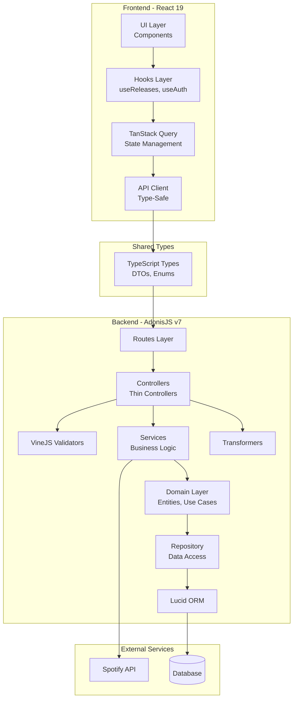
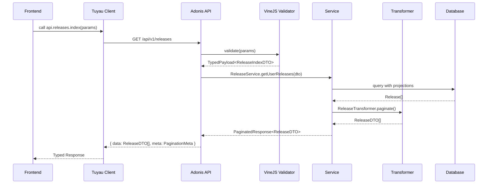

# Piano di Refactoring: Clean Architecture & Type Safety

## Overview

Questo documento descrive il piano di refactoring per trasformare l'applicazione Music Release Artists in una codebase moderna, type-safe e conforme ai principi Clean Code.

## ✅ Stato Implementazione (Aggiornato: 2026-03-27)

### Completati
- [x] **Backend**: `ReleaseService` e `ArtistService` creati con logica di business isolata
- [x] **Backend**: Controller refactorati con Rule of 30 (max 30 righe)
- [x] **Backend**: Costanti centralizzate in `app/utils/constants.ts`
- [x] **Backend**: Tipi API condivisi in `app/types/api.ts` con DTOs type-safe
- [x] **Backend**: Transformers con generic types (`ReleaseTransformer`, `ArtistTransformer`, `UserTransformer`)
- [x] **Backend**: Barrel exports per services
- [x] **Frontend**: API client type-safe con tipi inferiti
- [x] **Frontend**: Tipi condivisi aggiornati con `ApiActions`
- [x] **Frontend**: Hooks refactorati con Query Key Factory pattern
- [x] **Frontend**: Optimistic updates implementati in `useNotificationSettings`
- [x] **Frontend**: Error Boundary component creato
- [x] **Frontend**: Barrel exports per hooks e components

### In Corso
- [ ] Refactoring form con `useActionState`
- [ ] Component decomposition per DashboardPage
- [ ] React 19 `use` hook per lazy fetching

### Da Completare
- [ ] Custom VineJS rules per validazioni complesse
- [ ] Domain Layer (entities, use cases, repositories)
- [ ] Tuyau client generation per E2E type safety
- [ ] Zod runtime validation
- [ ] PersistQueryClient per offline support
- [ ] ESLint rules per Clean Code
- [ ] API documentation

## Architettura Target

### Clean Architecture Layers



### Data Flow Type-Safe



## Struttura Cartelle Proposta

### Backend

```
backend/
├── app/
│   ├── controllers/          # Thin controllers (<30 righe)
│   ├── validators/           # VineJS schemas
│   ├── transformers/         # Output serialization
│   ├── services/             # Business logic
│   ├── domain/               # NEW: Clean Architecture Core
│   │   ├── entities/         # Domain entities (pure TS)
│   │   ├── use-cases/        # Business operations
│   │   ├── repositories/     # Repository interfaces
│   │   └── dtos/             # Data Transfer Objects
│   ├── infrastructure/       # NEW: Adonis-specific
│   │   ├── persistence/      # Lucid implementations
│   │   ├── http/             # HTTP concerns
│   │   └── external/         # Spotify API client
│   └── models/               # Lucid Models (thin)
├── types/                    # NEW: Shared TypeScript
│   ├── api.ts               # API response types
│   └── index.ts             # Barrel export
└── ...
```

### Frontend

```
frontend/
├── src/
│   ├── components/           # React components
│   │   ├── ui/              # shadcn/ui components
│   │   ├── releases/        # Release-related
│   │   ├── settings/        # Settings forms
│   │   └── layouts/         # Layout wrappers
│   ├── hooks/               # React hooks
│   │   ├── queries/         # NEW: TanStack Query
│   │   ├── mutations/       # NEW: Mutations
│   │   └── use-*.ts         # Feature hooks
│   ├── lib/                 # Utilities
│   │   ├── api/             # NEW: Generated Tuyau client
│   │   ├── query-client.ts  # React Query setup
│   │   └── utils.ts         # Helpers
│   ├── types/               # TypeScript types
│   │   └── index.ts         # Shared with backend
│   └── pages/               # Route components
└── ...
```

## Implementazione Dettagliata

### 1. Backend: Service Layer Refactoring

#### Prima (Violazione Rule of 30):
```typescript
// ❌ Controller con troppa logica (50+ righe)
async sync({ auth, serialize }: HttpContext) {
  const user = auth.getUserOrFail()
  const accessToken = await SpotifyService.getValidAccessToken(user)
  const artists = await user.related('artists').query()
  let totalSynced = 0
  for (const artist of artists) {
    const albums = await SpotifyService.getArtistAlbums(...)
    for (const album of albums) {
      // 20+ righe di logica di upsert...
    }
  }
  return serialize({ message: ... })
}
```

#### Dopo (Clean Architecture):
```typescript
// ✅ Controller thin (<15 righe)
async sync({ auth, serialize }: HttpContext) {
  const user = auth.getUserOrFail()
  const result = await this.releaseSyncUseCase.execute({ userId: user.id })
  return serialize(result)
}

// ✅ Use Case isolato e testabile
class ReleaseSyncUseCase {
  constructor(
    private releaseRepo: ReleaseRepository,
    private spotifyClient: SpotifyClient
  ) {}
  
  async execute(input: SyncInput): Promise<SyncResult> {
    // Business logic isolata
  }
}
```

### 2. Frontend: React 19 Patterns

#### Prima:
```typescript
// ❌ Pattern React 18 classico
const [data, setData] = useState(null)
useEffect(() => {
  fetchData().then(setData)
}, [id])
```

#### Dopo:
```typescript
// ✅ React 19 use hook per lazy fetching
const releasesPromise = useReleasesSuspense(filters)
const releases = use(releasesPromise)

// ✅ useActionState per form
const [state, submitAction, isPending] = useActionState(
  async (prevState, formData) => {
    return await loginAction(formData)
  },
  initialState
)
```

### 3. End-to-End Type Safety con Tuyau

Tuyau è già installato nel progetto. Configurazione completa:

```typescript
// frontend/src/lib/api.ts
import { createTuyauClient } from '@tuyau/client'
import type { ApiDefinition } from '@backend/data' // Generated

export const tuyau = createTuyauClient<ApiDefinition>({
  baseUrl: '/api/v1',
})

// Type-safe API calls
const response = await tuyau.releases.index({ 
  query: { page: 1, type: 'album' } 
})
// response.data è fully typed!
```

### 4. Domain Layer - Repository Pattern

```typescript
// app/domain/repositories/release_repository.ts
export interface ReleaseRepository {
  findByArtistId(artistId: number): Promise<Release[]>
  findByUserId(userId: number, filters: ReleaseFilters): Promise<PaginatedResult<Release>>
  upsert(data: CreateReleaseDTO): Promise<Release>
}

// app/infrastructure/persistence/lucid_release_repository.ts
export class LucidReleaseRepository implements ReleaseRepository {
  constructor(private orm: typeof Release) {}
  // Implementazione con Lucid
}
```

## Metriche di Successo

| Metrica | Target | Come Misurare |
|---------|--------|---------------|
| Linee per funzione | ≤30 | ESLint `max-lines-per-function` |
| Type coverage | 100% | `tsc --noEmit` |
| Cyclomatic Complexity | ≤10 | Code Climate / SonarQube |
| Duplicazione codice | <3% | jscpd |
| Test coverage | >80% | Japa / Vitest |

## Note sull'Implementazione

1. **Progressività**: Il refactoring sarà fatto in fasi indipendenti
2. **Backward Compatibility**: Ogni fase mantiene l'app funzionante
3. **Testing**: Test esistenti devono passare dopo ogni fase
4. **Documentazione**: Ogni nuovo modulo avrà JSDoc completo
